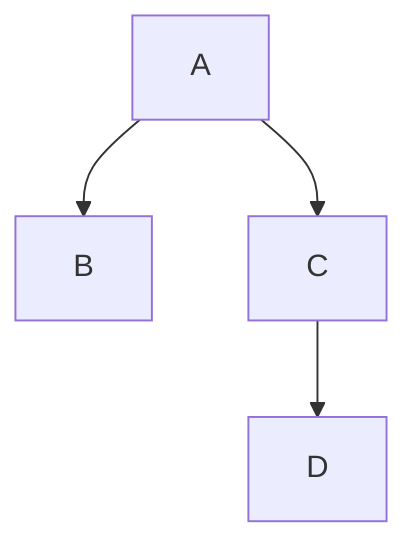
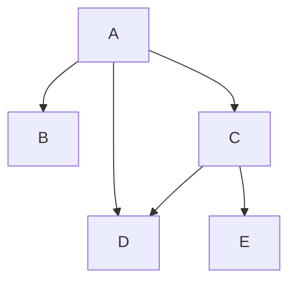

# GIMBAP - Go Injection Management for Better Application Programming


(G)o
(I)njection
(M)anagement for
(B)etter
(A)pplication
(P)rogramming

## Why GIMBAP?

Gimbap is a Korean-style see-weed roll that is similar to sushi. It is a simple and easy to make dish that is popular in Korea. The name GIMBAP is chosen as the acronym because it's one of my favourite dishes!.

Gimbap is a food where vegetables, fish and meat are rolled in a seaweed sheet with cooked rice. The seaweed sheet connects all the ingredients together and makes it easy to eat.

Like this GIMBAP aims to provide a simple solution to build web application in Go, connecting all components together in a simple and easy way.

## Introduction

This is a Go Web framework inspired by Nest.JS and Spring, introducing similar patterns of the frameworks and adapt it to the Golang style pattern

Even major web frameworks like `gin` intializes routing handlers as below

```golang
r := gin.Default()

r.GET("/test", a.Handler1)
r.POST("/test", a,Handler2)
```

which is similar to the classic Node.JS's `express`.

```js
const app = express();
const a = new A();

app.get("/test", a.handler1);
app.post("/test", a.handler2);
```

The huge advantages of frameworks like NestJS and Spring, are its AOP patterns and strict model hierarchy that allows simpler design patterns.

For example, the simple code above to define router handlers would be like below

```ts
@Controller()
class TestController {
  @Get("test")
  public async handler1() {
    /* ... */
  }

  @Post("test")
  public async handler1() {
    /* ... */
  }
}
```

```java
@RestController
class TestController {
  @GetMapping("/test")
  public String handler1() {/* ... */}

  @PostMapping("/test")
  public String handler2() {/* ... */}
}
```

For small applications, the current pattern should work fine, but as projects grow and get bigger, AOPs help to manage the code in a managed way.

For example, imagine a group of classes/structs that have a dependency graph as below



in classic Go and Gin, you would have to initialize the dependencies in the main function and pass it to the handler.

```golang
func main() {
    a := NewA()
    b := NewB(a)
    c := NewC(a)
    d := NewD(c)
}
```

Then if a new dependency is added like below, you would have to modify the main function and all the handlers that use the dependency.



```golang
func main() {
    a := NewA()
    b := NewB(a)
    c := NewC(a)
    d := NewD(c, a)
    e := NewE(d)
}
```

Like this if dependecies grow, the difficulty of managing the dependencies manually will grow as well. Go has many DI libraries like `uber/fx`, `google/wire`, `facebookgo/inject` but they are more focused on DI itself.

As a Go newbie, I found it rather unusual to manage dependencies in Go compared to other frameworks I used (like Spring, NestJS) thus I decided to create a framework that will help manage dependencies in a more structured way. Resulting in a new framework with a simple structured way like below.

```golang
package example

import "github.com/jhseong7/gimbap"

var RootModule = gimbap.DefineModule(gimbap.ModuleOption{
	Name: "RootModule",
	SubModules: []gimbap.Module{
		*ProviderA,
		*ProviderB,
    *ProviderC,
    *ProviderD,
    *ProviderE
	},
})

func main() {
  app := gimbap.CreateApp(gimbap.AppOption{
    Name: "ExampleApp",
    AppModule: RootModule,
  })

  app.Run()
}
```

GIMBAP will allow to flexibly manage, add remove or delete, dependencies in a structured with similar MVC/AOP like patterns like Spring or NestJS.

Please check the documentation and samples for more information.

## Documentation

[Documentation](doc/documentation.md)

## Installation

```shell
go get github.com/jhseong7/gimbap
```

## Sample Code

[Sample Repo](https://github.com/jhseong7/gimbap-sample)

## Goals

This framework provides the following features:

- Module based Dependency Injection (DI)
  - This will use `uber/fx` for runtime DI
- `Controller` adapter pattern.
  - Adapters can be replaced but the framework will provide a constant handler spec
  - GIN + a
- `Injectable` interface for module based DI
  - All services, repos that require DI must be specified in the right way
- ORM adapters
  - external module. This will be vendor-locked to that specific module.
  - initial support will start with `gORM` and `prisma-go`
- Config manager (dotenv, config service)
- Container based server control
  - Container isolation like NestJS or Spring
  - May be a bean-like config management
- Panic handle middleware support
- Interceptor, Guard support

## Third-Party Libraries

This project uses the following third-party libraries:

- **Library Name:** uber-go/fx
  - **Purpose:** Used managing dependency injection with-in the app
  - **License:** MIT License. [Link](https://github.com/uber-go/fx/blob/master/LICENSE)
  - **Link:** [https://github.com/uber-go/fx](https://github.com/uber-go/fx)
