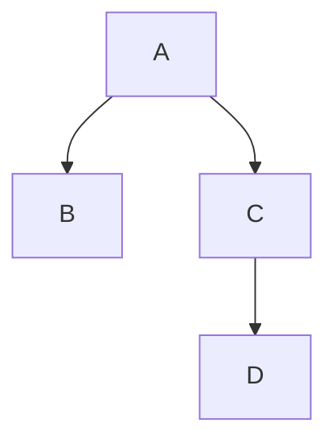
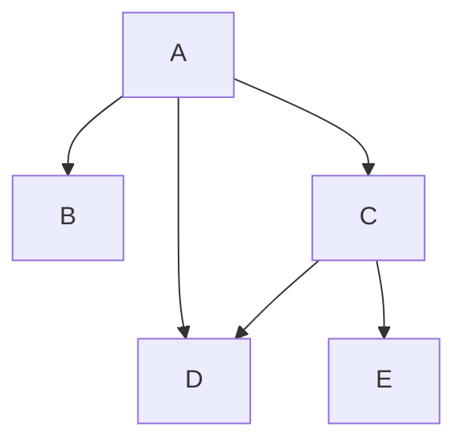

## How GIMBAP Started

When I started by experience with Go in early 2024, I was surprised by the goods of Go, but at the sametime disappointed by the lack of a good framework to build a web application such as Spring in Java, NestJS in Node.JS, or Django in Python.

Albeit that in Go you can more control over the low-level details compared to Java, Node.JS, or Python, it still was a pain to write a web application in a more enterprise-level.

Simple applications with a few handlers will not be an issue, but when the application grows, it becomes a mess to manage the handlers, middlewares, and other components, especially when managing dependencies between the components.

Below is an example of a bootstrap process when using a Gin app in Go.

```golang
func main() {
  gin := gin.Default()

  db := NewDB()

  svc1 := NewService1(db)
  svc2 := NewService2(sv1, db)

  api := NewAPI()
  api2 := NewAPI2(svc1, svc2)

  gin.GET("/a1", api.Handler1)
  gin.GET("/a2", api.Handler2)
  gin.GET("/a3", api.Handler3)
  gin.GET("/a4", api.Handler4)
  gin.GET("/a5", api.Handler5)
  gin.GET("/a6", api2.Handler1)
  gin.GET("/a7", api2.Handler2)
  gin.GET("/a8", api2.Handler3)


  server := &http.Server{
		Addr:           ":8080",
		Handler:        gin,
	}

  server.ListenAndServe()
}
```

Then imagine a new `svc1_5` that depends on `svc1`, and is a new input to svc2 and api1, then the code will be like below.

```golang
func main() {
  gin := gin.Default()

  db := NewDB()

  svc1 := NewService1(db)
  svc1_5 := NewService1_5(svc1)
  svc2 := NewService2(sv1, db, svc1_5)

  api := NewAPI(svc1_5)
  api2 := NewAPI2(svc1, svc2)

  gin.GET("/a1", api.Handler1)
  gin.GET("/a2", api.Handler2)
  gin.GET("/a3", api.Handler3)
  gin.GET("/a4", api.Handler4)
  gin.GET("/a5", api.Handler5)
  gin.GET("/a6", api2.Handler1)
  gin.GET("/a7", api2.Handler2)
  gin.GET("/a8", api2.Handler3)


  server := &http.Server{
		Addr:           ":8080",
		Handler:        gin,
	}

  server.ListenAndServe()
}
```

For small applications, the current pattern should work fine, but as projects grow and get bigger, AOPs help to manage the code in a managed way.

For example, imagine a group of classes/structs that have a dependency graph as below



in classic Go and Gin, you would have to initialize the dependencies in the main function and pass it to the handler.

```golang
func main() {
    a := NewA()
    b := NewB(a)
    c := NewC(a)
    d := NewD(c)
}
```

Then if a new dependency is added like below, you would have to modify the main function and all the handlers that use the dependency.



```golang
func main() {
    a := NewA()
    b := NewB(a)
    c := NewC(a)
    d := NewD(c, a)
    e := NewE(d)
}
```

If it was the case for a Spring Boot Application, the code would be like below.

**TO-BE**

```java
@Service("Service2")
class Service2 {
  @Autowired
  private Service1 service1;

  // ... something more
}
```

**AS-IS**

```java
@Service("Service2")
class Service2 {
  @Autowired
  private Service1 service1;

  @Autowired
  private Service1_5 service1_5;

  // ... something more
}
```

If it was the case for a NestJS Application, the code would be like below.

**TO-BE**

```ts
@Injectable()
class Service2 {
  constructor(private service1: Service1) {}

  // ... something more
}
```

**AS-IS**

```ts
@Injectable()
class Service2 {
  constructor(private service1: Service1, private service1_5: Service1_5) {}

  // ... something more
}
```

Having sometime in managing the code in Go, and having experience in Spring Boot and NestJS, I decided to make a framework that can be used to build web apps in Go in a similar way to Spring Boot and NestJS.
