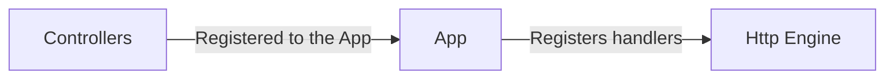

# Main Concept and Architecture

The main concept of GIMBAP is to make a framework that can be used to build a simple web application with minimal boilerplating and easy to understand code.

The main component of GIMBAP is called an "App".

And each app has some core features like below:

- Dependency Management
- Server Engine
- Microservices

## Dependency Management

The dependency management of GIMBAP is managed by the module `IDependencyManger`.

The manager takes a set of providers and returns a map of instances with the dependencies resolved.

GIMBAP manages the chain of dependencies given through the `Module` struct, automatically injects the dependency provides and initialized at least one instance of the given providers.

For example, if the app is given a module with a provider with a struct of `Service1` and `Service2`, where suppose `Service2` depends on `Service1`, GIMBAP will automatically create singleton instances of `Service1` and `Service2` and use the instance of `Service1` when initializing `Service2`.

This does not only apply to Service level providers. Any Go struct that is unique can be used as a provider where all components that require that as a parameter of the constructor will be automatically injected by the app.

please check the Modules and Providers section for more information. [Link](./modules-providers.md)

The current default (and only for now) dependency manager is the `FxDependencyManager` which uses `uber-go/fx` as its core resolver.

### Limitations

Since DI works by identifying the given struct's type and building the dependency graph upon it, there are some limitations to the DI system.

1. All dependency provider's type must be unique
   - 2 or more providers of the exact same type will cause a panic in the DI system
   - For the same reason, interfaces and array type structs are not supported as providers
2. Circular dependencies are not supported
   - Circular dependencies will cause a panic in the DI system
   - e.g. `A -> B -> C -> A` is not allowed

## Server Engine

GIMBAP always requires a single server to run the application. This server is build in a modular form called the `Server Engine`

A Server Engine must implement the interface `engine.IServerEngine` where the specs are as follows

```golang
type IServerEngine interface {
  RegisterController(rootPath string, controller controller.IController)
  Run(port int)
  Stop()
  AddMiddleware(middleware ...interface{})
}
```

The `RegisterController` method is called to register a controller to the engine, which is called with the path, method, handler function of which the engine will call when the path is matched.



The handlers for the Http Engine must be native to the engine's http server. For example, if the engine is using GIN, the handler must be a GIN handler.

```golang
func (c *Controller) Handler(c *gin.Context) {
  c.JSON(200, gin.H{
    "message": "Hello World",
  })
}
```

If the server is fiber, then the handlers would look like this

```golang
func (c *Controller) Handler(c *fiber.Ctx) error {
  return c.JSON(fiber.Map{
    "message": "Hello World",
  })
}
```

Although GIMBAP does not officially support multiple http engines, and mixing handler types, but technically a custom engine can be built and used with GIMBAP, so feel free to experiment 😎

GIMBAP currently supports the following http engines by default:

- GIN
- Fiber
- Echo
- Null

Null Engines are provided just in case if you are to use GIMBAP as somewhat other than a web server.

If you are up to developing a new engine yourself, feel free to reference the `/engine` directory for the existing engines

## Microservices

Microservices are special logics that are automatically started and stopped by the app's lifecycle. These are designed to be used for other types of servers other than the http server.

Examples of microservices are:

- gRPC servers
- Websocket servers
- TCP servers

The key difference between a microservice and a microservice is that a microservice are treated like dependency providers, thus are injected with dependencies if there are any.

Microservices must implement the interface `IMicroServices` which is defined as follows.

```golang
type IMicroService interface {
  // Start the microservice
  Start()

  // Gracefully stop the microservice
  Stop()
}
```

The only thing GIMBAP manages for the microservices are:

- Lifecycle methods
- Dependency injections

So anything that needs to reside with the main server engine can be implemented as a MicroService.

The microservices must stop within 5 seconds when the Start(), Or Stop() is called. This is to prevent any blocking events on app closing.

The start and stop of the microservices are handled in order of the which it was added to the app via `app.AddMicroServices`
