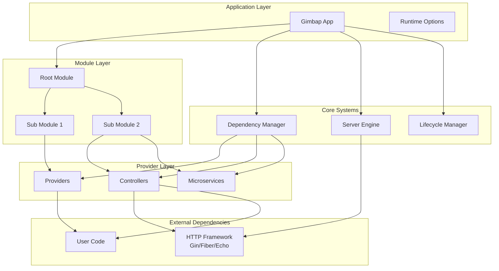
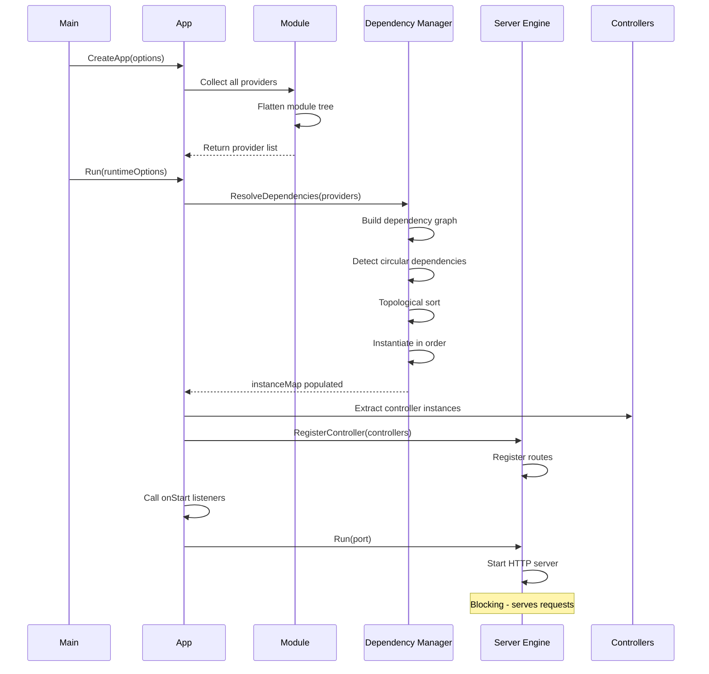
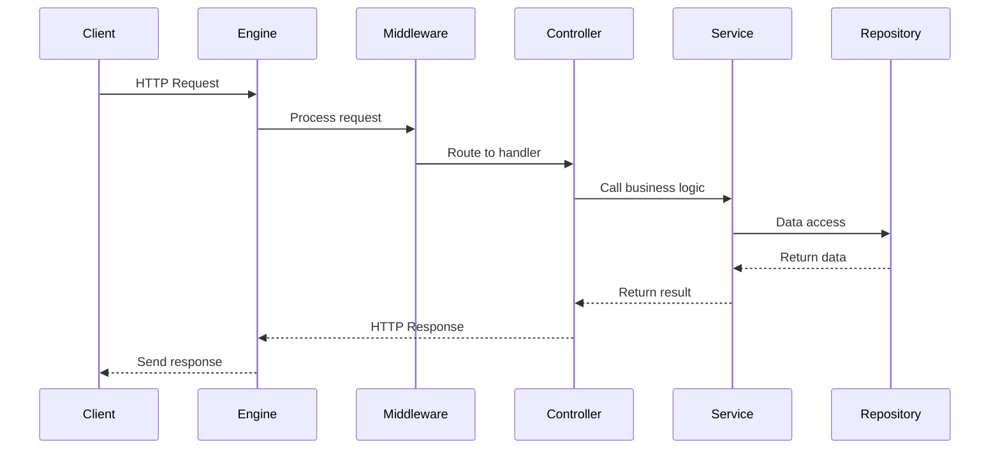
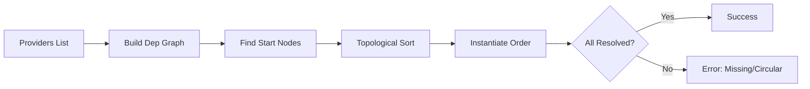
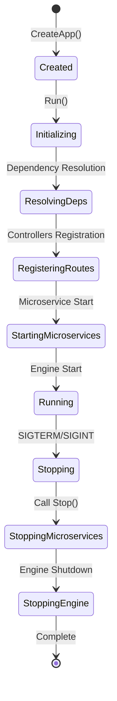

# Architecture Overview

This page provides a comprehensive overview of GIMBAP's internal architecture, design decisions, and how all components work together.

import { Callout } from '../../components/Callout';

## High-Level Architecture

GIMBAP follows a layered architecture with clear separation of concerns:



<Callout type="info">
GIMBAP acts as an orchestration layer that manages dependencies, lifecycle, and routing while delegating actual HTTP handling to proven frameworks.
</Callout>

## Component Interaction

### Application Startup Flow



### Request Handling Flow



## Core Components Deep Dive

### 1. Gimbap App (Application Container)

The central orchestrator that ties everything together:

```
┌─────────────────────────────────────────┐
│         Gimbap App Container            │
├─────────────────────────────────────────┤
│ - appModule: Root Module                │
│ - serverEngine: IServerEngine           │
│ - depManager: IDependencyManager        │
│ - instanceMap: Type → Instance          │
│ - onStartListeners: []func()            │
│ - onStopListeners: []func()             │
│ - microservices: []IMicroService        │
│ - shutdownFlag: chan string             │
└─────────────────────────────────────────┘
```

**Responsibilities:**
- Manages application lifecycle
- Coordinates dependency resolution
- Registers controllers with the engine
- Handles graceful shutdown
- Manages microservices

### 2. Module System

Modules organize providers and controllers into logical units:

```
┌──────────────────────────────────────────┐
│             Module                       │
├──────────────────────────────────────────┤
│ - Name: string                           │
│ - providerList: []*Provider              │
│ - providerMapWithHandler: map            │
│   ├─ "default" → Regular Providers       │
│   ├─ "controller" → Controllers          │
│   └─ "microservice" → Microservices      │
└──────────────────────────────────────────┘
         │
         ├─ SubModule 1
         ├─ SubModule 2
         └─ SubModule N
```

**Module Hierarchy:**

```
Root Module (AppModule)
  ├── DatabaseModule
  │     ├── PostgreSQLProvider
  │     └── RedisProvider
  ├── UserModule
  │     ├── UserService
  │     ├── UserRepository
  │     └── UserController
  └── AuthModule
        ├── JWTService
        ├── AuthService
        └── AuthController
```

### 3. Provider System

Providers are the building blocks of dependency injection:

```go
type Provider struct {
    Name         string      // Human-readable name
    Instantiator interface{} // Constructor function
    Handler      ProviderHandlerName // "default", "controller", "microservice"
}
```

**Provider Types:**

```
Regular Provider
  └─ Instantiator: func(...deps) *Service

Controller Provider
  └─ Instantiator: func(...deps) *Controller
  └─ Must implement: IController interface

Microservice Provider
  └─ Instantiator: func(...deps) *MicroService
  └─ Must implement: IMicroService interface
```

### 4. Dependency Manager

The brain of the dependency injection system:



**Algorithm:**

1. **Graph Construction**: Build dependency graph from constructor parameters
2. **Start Nodes**: Identify providers with zero dependencies
3. **Queue Processing**: Process providers whose dependencies are satisfied
4. **Instantiation**: Call constructor with resolved dependencies
5. **Requeue**: If dependencies not ready, requeue with limit
6. **Validation**: Detect circular dependencies and missing providers

### 5. Server Engine

Abstraction layer over HTTP frameworks:

```go
type IServerEngine interface {
    RegisterController(rootPath string, controller IController)
    Run(option ServerRuntimeOption)
    Stop()
    AddMiddleware(middleware ...interface{})
    AddStatic(prefix, root string, config ...interface{})
}
```

**Engine Adapters:**

```
IServerEngine (Interface)
  ├── GinHttpEngine
  │     └── Uses: gin-gonic/gin
  ├── FiberHttpEngine
  │     └── Uses: gofiber/fiber
  └── EchoHttpEngine
        └── Uses: labstack/echo
```

## Data Flow Architecture

### Dependency Resolution

```
┌─────────────────────────────────────────────┐
│    Module Tree Traversal                    │
│    ┌──────────┐                             │
│    │ Root Mod │                             │
│    └─────┬────┘                             │
│          ├─ Module A                        │
│          │    ├─ Provider 1                 │
│          │    └─ Provider 2                 │
│          └─ Module B                        │
│               └─ Provider 3                 │
└─────────────────┬───────────────────────────┘
                  │
                  ▼
┌─────────────────────────────────────────────┐
│    Flatten to Provider List                 │
│    [Prov1, Prov2, Prov3]                    │
└─────────────────┬───────────────────────────┘
                  │
                  ▼
┌─────────────────────────────────────────────┐
│    Build Dependency Graph                   │
│                                              │
│    Prov3 ──requires──> Prov1                │
│    Prov2 ──requires──> Prov1                │
│    Prov1 ──requires──> (none)               │
└─────────────────┬───────────────────────────┘
                  │
                  ▼
┌─────────────────────────────────────────────┐
│    Resolve in Order                         │
│    1. Instantiate Prov1 (no deps)           │
│    2. Instantiate Prov2 (has Prov1)         │
│    3. Instantiate Prov3 (has Prov1)         │
└─────────────────┬───────────────────────────┘
                  │
                  ▼
┌─────────────────────────────────────────────┐
│    Instance Map                             │
│    Type[Prov1] → instance1                  │
│    Type[Prov2] → instance2                  │
│    Type[Prov3] → instance3                  │
└─────────────────────────────────────────────┘
```

### Controller Registration

```
┌─────────────────────────────────────────────┐
│    Extract Controllers from Module          │
│    providerMapWithHandler["controller"]     │
└─────────────────┬───────────────────────────┘
                  │
                  ▼
┌─────────────────────────────────────────────┐
│    Get Controller Instance                  │
│    instance = instanceMap[ControllerType]   │
└─────────────────┬───────────────────────────┘
                  │
                  ▼
┌─────────────────────────────────────────────┐
│    Call GetRouteSpecs()                     │
│    routes = controller.GetRouteSpecs()      │
└─────────────────┬───────────────────────────┘
                  │
                  ▼
┌─────────────────────────────────────────────┐
│    Register with Engine                     │
│    For each route:                          │
│      engine.Handle(method, path, handler)   │
└─────────────────────────────────────────────┘
```

## Lifecycle Management

### Application Lifecycle



### Graceful Shutdown Sequence

```
1. Signal Received (SIGTERM/SIGINT)
   │
   ▼
2. Stop Flag Set
   │
   ▼
3. Stop HTTP Engine (max 5s)
   ├─ Stop accepting new requests
   ├─ Wait for active requests
   └─ Force close if timeout
   │
   ▼
4. Call onStop Listeners
   │
   ▼
5. Stop Microservices (each max 5s)
   ├─ Call microservice.Stop()
   └─ Force terminate if timeout
   │
   ▼
6. Send Shutdown Signal
   │
   ▼
7. Exit
```

## Type System & Reflection

GIMBAP uses Go's `reflect` package to enable dependency injection:

```go
// Provider registration
Provider{
    Name: "UserService",
    Instantiator: func(db *Database) *UserService { ... }
}

// Type extraction
funcType := reflect.TypeOf(Instantiator)
// funcType.In(0) = *Database (input parameter)
// funcType.Out(0) = *UserService (return type)

// Dependency graph
// *UserService requires *Database
```

**Type Identification:**

```
reflect.Type uniquely identifies each provider:
- *UserService
- *Database
- *JWTService

Instance Map:
  reflect.TypeOf(*UserService{}) → userServiceInstance
  reflect.TypeOf(*Database{}) → databaseInstance
```

<Callout type="warning">
**Performance Note**: Reflection adds minimal overhead at startup during dependency resolution. At runtime, all instances are resolved and cached - no reflection is used during request handling.
</Callout>

## Design Patterns Used

### 1. **Dependency Injection Pattern**
- Constructor injection
- Container-managed lifecycle

### 2. **Module Pattern**
- Encapsulation of related components
- Hierarchical organization

### 3. **Strategy Pattern**
- Pluggable HTTP engines
- Pluggable dependency managers

### 4. **Adapter Pattern**
- Engine adapters (Gin/Fiber/Echo)
- Uniform interface over different implementations

### 5. **Registry Pattern**
- Provider registry in modules
- Instance registry in app

### 6. **Factory Pattern**
- Provider instantiators
- Engine factories

### 7. **Observer Pattern**
- Lifecycle hooks (onStart, onStop)

## Performance Characteristics

### Memory

```
Base Overhead:
  - Instance Map: O(n) where n = number of providers
  - Dependency Graph: O(e) where e = edges (dependencies)
  - Controllers: O(c) where c = number of controllers

Runtime Memory:
  - All instances are singletons
  - No per-request allocations for DI
```

### Startup Time

```
Dependency Resolution: O(n log n + e)
  - n = number of providers
  - e = number of dependencies
  - Topological sort dominates

Controller Registration: O(c * r)
  - c = number of controllers
  - r = average routes per controller
```

### Request Handling

```
After startup, GIMBAP adds:
  - Zero overhead for DI (instances pre-resolved)
  - Minimal overhead for routing (native engine)
  - Controller method call (standard function call)

Effectively: Same performance as native Gin/Fiber/Echo
```

## Thread Safety

- **Instance Map**: Read-only after initialization (thread-safe)
- **Dependency Resolution**: Single-threaded during startup
- **Request Handling**: Fully concurrent (engine-dependent)
- **Lifecycle Hooks**: Sequential execution

<Callout type="tip">
All expensive operations (dependency resolution, reflection) happen at startup. Request handling is as fast as the underlying HTTP framework.
</Callout>

## Extension Points

GIMBAP provides several extension points:

1. **Custom Dependency Manager**: Implement `IDependencyManager`
2. **Custom Server Engine**: Implement `IServerEngine`
3. **Lifecycle Hooks**: `onStart`, `onStop` listeners
4. **Middleware**: Engine-native middleware support
5. **Microservices**: Implement `IMicroService`

## Next Steps

<div style={{display: 'grid', gridTemplateColumns: 'repeat(auto-fit, minmax(250px, 1fr))', gap: '1rem', marginTop: '2rem'}}>
  <a href="/architecture/dependency-injection" style={{padding: '1rem', border: '1px solid #e5e7eb', borderRadius: '8px', textDecoration: 'none', color: 'inherit'}}>
    <strong>Dependency Injection Deep Dive</strong>
    <p style={{fontSize: '0.9rem', color: '#6b7280', margin: '0.5rem 0 0 0'}}>Learn the DI algorithm in detail</p>
  </a>

  <a href="/architecture/design-patterns" style={{padding: '1rem', border: '1px solid #e5e7eb', borderRadius: '8px', textDecoration: 'none', color: 'inherit'}}>
    <strong>Design Patterns</strong>
    <p style={{fontSize: '0.9rem', color: '#6b7280', margin: '0.5rem 0 0 0'}}>Patterns used in GIMBAP</p>
  </a>

  <a href="/architecture/lifecycle" style={{padding: '1rem', border: '1px solid #e5e7eb', borderRadius: '8px', textDecoration: 'none', color: 'inherit'}}>
    <strong>Lifecycle & Flow</strong>
    <p style={{fontSize: '0.9rem', color: '#6b7280', margin: '0.5rem 0 0 0'}}>Detailed lifecycle diagrams</p>
  </a>
</div>
