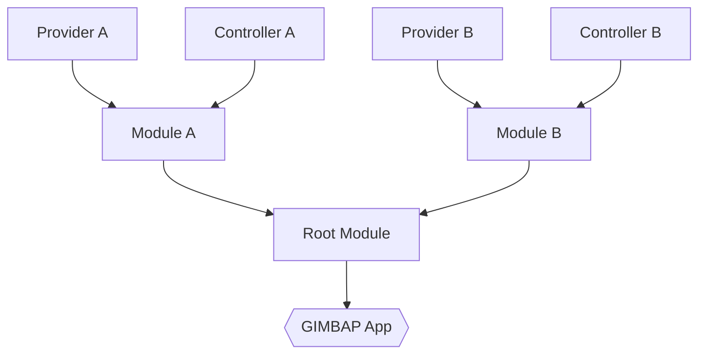

# Modules and Providers

## Introduction

One of the main goals of GIMBAP is to provide a simple way to manage dependencies in a structured way, like in Spring and NestJS.

The main features are:

- Module based Dependency Injection (DI)
- `Controller` adapter pattern for easy MVC pattern like Spring and NestJS

However in Go, the pattern is a bit different from other languages due to limitations in Go itself:

- Go does not have a 'class' pattern
  - This limits constructor based DI
- Go does not have 'annotaions/decorator' patterns
  - This limits the ablitity to use annotaions to get a AOP style pattern.

Thus, GIMBAP will have a different pattern compared to Spring and NestJS, however the core concept of simple DI will be the same.

## Module based Dependency Injection (DI)

GIMBAP introduces `module`s. A module is a collection of `provider`s that are Go structs that need to be injected.

Providers are Go struct that define what must be injected, and what will be given after the injection.

Controllers are special providers that have to inherit a special interface that will be used to define the routing handlers automatically.

Modules can include other modules to collect a set of providers which the DI framework will use to inject all the dependencies between each other.



It is recommended to use a single root module an provide it to the GIMBAP app to start the DI process, but it is possible to use multiple modules and provide them to the app directly.

Since Go's structs have unique identifiers, the providers in the modules can request providers from other modules if the dependencies do not end up in a circular dependency.

For example, if A depends on B and B depends on A, the DI will fail to inject the dependencies as it will cause a chicken and egg problem.

## Provider

The provider for GIMBAP must provide some key information to the DI framework.

- A constructor function that takes in dependencies as parameters, returning the provider itself.

Since the framework determines the DI relationship upon the provider's constructor, the provider must crutially define:

- What it needs to initialize
- What it provides to other providers

Below is an example of the provider pattern

```go
package example

import "github.com/jhseong7/gimbap"

type (
	SaltService struct {
		Name string
	}
)

func (s *SaltService) GetName() string {
	return s.Name
}

func NewSalt() *SaltService {
	return &SaltService{
		Name: "Salty Salt!!",
	}
}

var SaltProvider = gimbap.DefineProvider(gimbap.ProviderOption{
	Name:         "SaltService",
	Instantiator: NewSalt,
})
```

This provider will provide `*SaltService` to other providers that require it.

```go
package example

import (
	"github.com/jhseong7/gimbap"
)

type (
	FoodService struct {
		Name   string
		Salt   SaltService
	}
)

func (f *FoodService) GetName() string {
	return f.Name + " with " + f.Salt.GetName()
}

func NewFood(salt *SaltService) *FoodService {
	return &FoodService{
		Name:   "Food",
		Salt:   *salt,
	}
}

var FoodProvider = gimbap.DefineProvider(gimbap.ProviderOption{
	Name:         "FoodService",
	Instantiator: NewFood,
})
```

In this case, the `FoodService` will get an instance of the `SaltService` from the DI framework on initialization. If any other extra services are required later on, just by adding a new provider will make it possible to add a new dependency anywhere.

For example, imagine a new service called `ChefService` that is required by both `SaltService` and `FoodService`. Suppose that the provider for `ChefService` is already defined elsewhere.

Then the Construtor for `SaltService` and `FoodService` can be modified as below:

```go
func NewFood(chef *ChefService, salt *SaltService) *FoodService {
	return &FoodService{
		Name:   "Food",
		Salt:   *salt,
    Chef:   *chef
	}
}

func NewSalt(chef *ChefService) *SaltService {
	return &SaltService{
		Name: "Salty Salt!!",
    Chef: *chef,
	}
}
```

## Modules

If all the providers and controllers have been defined, the next step is to define the modules.

Modules can be defined as below:

```go
package example

import "github.com/jhseong7/gimbap"

var ExampleModule = gimbap.DefineModule(gimbap.ModuleOption{
  Name: "ExampleModule",
  Providers: []*gimbap.Provider{
    SaltProvider,
    FoodProvider,
  },
  Controllers: []*gimbap.Controller{
    FoodControllerProvider,
  },
})
```

A module initialized with the `DefineModule` function will be used to collect all the providers and controllers that are required for the DI framework.

Modules can also be combined to create a bigger module that can be used to start the DI process.

```go
var BiggerModule = gimbap.DefineModule(gimbap.ModuleOption{
  Name: "BiggerModule",
  SubModules: []*gimbap.Module{
    ExampleModule,
    AnotherModule,
  },
})
```

Then use the Module to start the GIMBAP App

```go
import "github.com/jhseong7/gimbap"

func main() {
  app := gimbap.CreateApp(gimbap.AppOption{
		AppName:   "SampleApp",
		AppModule: BiggerModule,
	})

  app.Run()
}
```

Since the GIMBAP app only accepts a single Root module, it is recommended to use a single root module.

If you intend to use a multi-module initialization, define the module directly in the `CreateApp` function.

```go
import "github.com/jhseong7/gimbap"

func main() {
  app := gimbap.CreateApp(gimbap.AppOption{
    AppName:   "SampleApp",
    AppModule: gimbap.DefineModule(gimbap.ModuleOption{
      Name: "RootModule",
      SubModules: []*gimbap.Module{
        ExampleModule,
        AnotherModule,
      },
    }),
  })

  app.Run()
}
```
