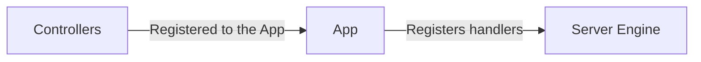

# Server Engine

## Introduction

GIMBAP always requires a single server to run the application. This server is build in a modular form called the `Server Engine`.
The key role of the server engine is to serve a web server that can handle the http requests and responses. The lifecycle of the GIMBAP app is literally the same as the server engine.

GIMBAP provides several default server engine that are implemented with some of the most popular web server libraries in Go:

1. GIN
2. Fiber
3. Echo

> The engines can easily be switched by preference, however the handlers are not yet compatible with each other, so be careful when switching the engines.

The api handlers for the engines are managed by GIMBAP, so the user does not need to work on the initial setup of the engine.

## Architecture

Internally, Server Engines are modules that implement the interface `engine.IServerEngine` where the specs are as follows

```go
type IServerEngine interface {
  RegisterController(rootPath string, controller controller.IController)
  Run(port int)
  Stop()
  AddMiddleware(middleware ...interface{})
}
```

The `RegisterController` method is called to register a controller to the engine, which is called with the path, method, handler function of which the engine will call when the path is matched.



The handlers for the Http Engine must be native to the engine's http server. For example, if the engine is using GIN, the handler must be a GIN handler.

```go
func (c *Controller) Handler(c *gin.Context) {
  c.JSON(200, gin.H{
    "message": "Hello World",
  })
}
```

If the server is fiber, then the handlers would look like this

```go
func (c *Controller) Handler(c *fiber.Ctx) error {
  return c.JSON(fiber.Map{
    "message": "Hello World",
  })
}
```

The handlers are engine-native for now.

## Supported Engines

GIMBAP currently supports the following http engines by default:

- GIN
- Fiber
- Echo
- Null

Null Engines are provided just in case if you are to use GIMBAP as somewhat other than a http server.

If you are up to developing a new engine yourself, feel free to reference the `/engine` directory for the existing engines
